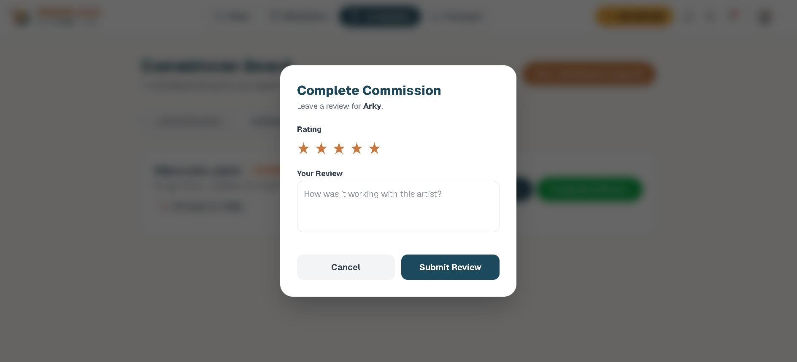
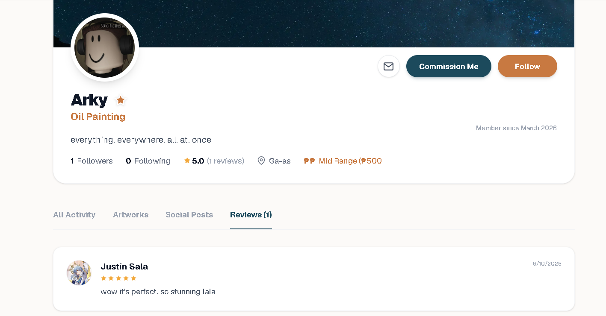

# Project Homepage > Artist Rating and Reviews

---

## Functional Description
The **Artist Rating and Reviews** module enables clients to rate an artist's performance and provide detailed feedback after a commission is completed. This system ensures transparency and helps maintain high quality within the community.

Key features include:
- **Star Ratings:** 1-5 star scale for quick evaluation.
- **Detailed Reviews:** Textual feedback for qualitative assessment.
- **Verification:** Reviews are linked to completed commission requests to ensure authenticity.
- **Reputation Display:** Cumulative ratings and recent reviews are displayed on the artist's public profile.

---

## Use Case Scenario

| Actor | Action | System Response |
| :--- | :--- | :--- |
| Client | Completes a commission and clicks the "Complete & Review" button | System displays the Rating and Review modal. |
| Client | Selects a star rating and writes a comment | System validates that both rating and comment are provided. |
| Client | Submits the review | System records the review in the `rating_reviews` table and marks the commission as `completed`. |
| Any User | Visits an artist's profile page | System calculates and displays the average star rating and list of reviews. |

---

[← Back to Project Homepage](project-homepage.md)

© 2026 Arktic
