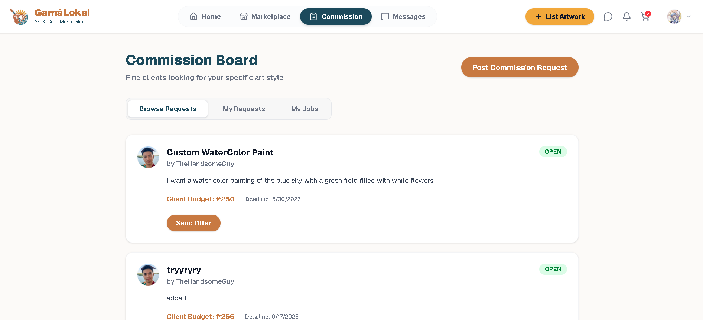
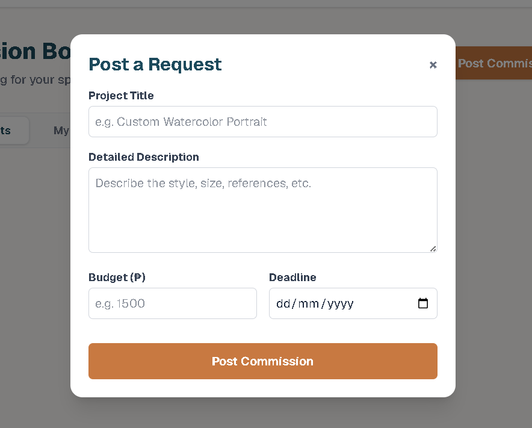

# Project Homepage > Commission Request Posting

---

## Functional Description
The **Commission Request Posting** module enables clients to post custom job requests on the community board. Artists can browse these requests and submit formal offers to provide their services.

Key features include:
- **Public Request Board:** Open marketplace for clients to describe their needs and budget.
- **Offer System:** Artists can propose specific pricing and deposit percentages for a request.
- **Milestone Payments:** Integrated with PayMongo for secure deposit and final payment handling.
- **Status Tracking:** Real-time updates as commissions move from 'open' to 'in progress' and 'completed'.

---

## Use Case Scenario

| Actor | Action | System Response |
| :--- | :--- | :--- |
| Client | Clicks "+ Post Commission Request" | System displays request creation modal. |
| Client | Enters title, description, and budget | System publishes the request to the commission board. |
| Artist | Clicks "Submit Offer" on a request | System prompts for offer amount, message, and deposit details. |
| Client | Accepts an artist's offer | System updates status to "Awaiting Deposit" and redirects client to checkout. |
| Artist | Marks commission as "Ready" | System updates status to "Awaiting Final Payment" and notifies the client. |

---

[← Back to Project Homepage](project-homepage.md)

© 2026 Arktic
