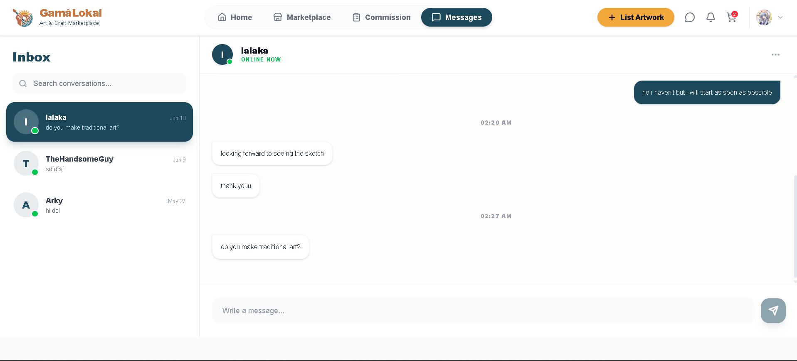

# Project Homepage > Secure Messaging System

---

## Functional Description
The **Secure Messaging System** provides a private channel for clients and artists to discuss commission details, share ideas, and finalize requirements.

Key features include:
- **Real-Time Text Messaging:** Instant communication between users powered by Supabase Realtime.
- **Unified Inbox:** Manage all active conversations from a single dashboard.
- **Artist Contact:** Initiate a direct conversation from any artist's profile or commission offer.
- **Privacy & Security:** Messages are only accessible to the sender and receiver.

---

## Use Case Scenario

| Actor | Action | System Response |
| :--- | :--- | :--- |
| User | Navigates to the Messages tab | System displays the inbox with a list of active conversations. |
| User | Selects a conversation | System loads the message history with that specific user. |
| User | Types a message and clicks "Send" | System instantly delivers the message and updates both users' views. |
| User | Receives a new message | System displays the message in the chat window in real-time. |

---

[← Back to Project Homepage](project-homepage.md)

© 2026 Arktic
