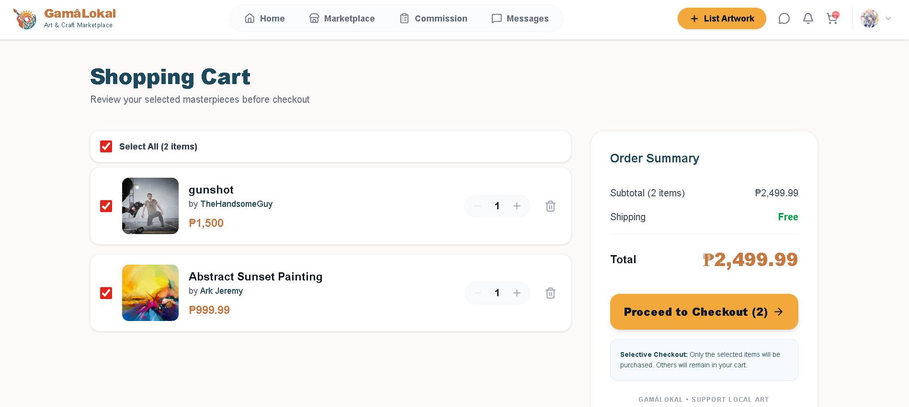
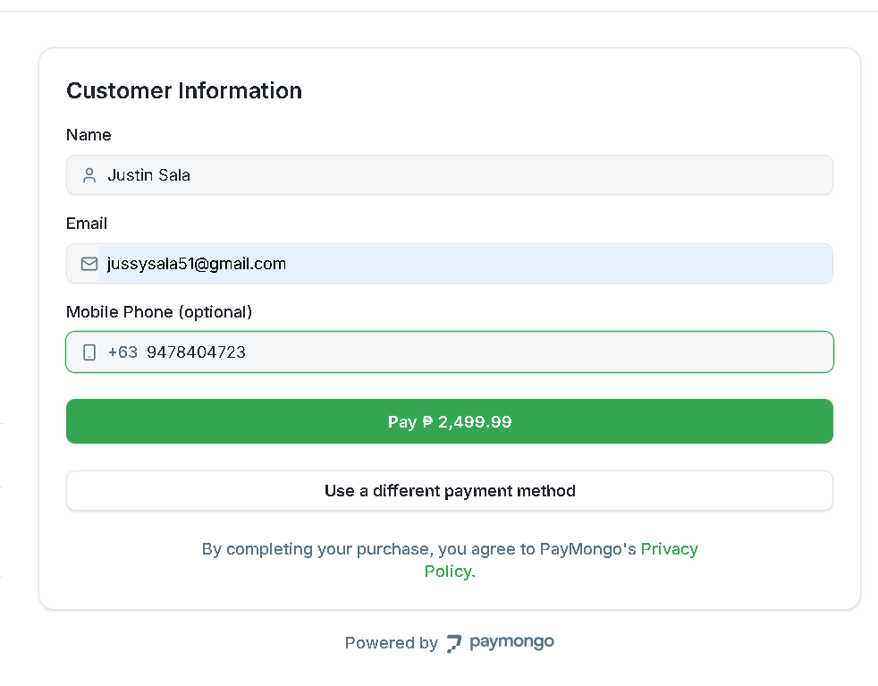
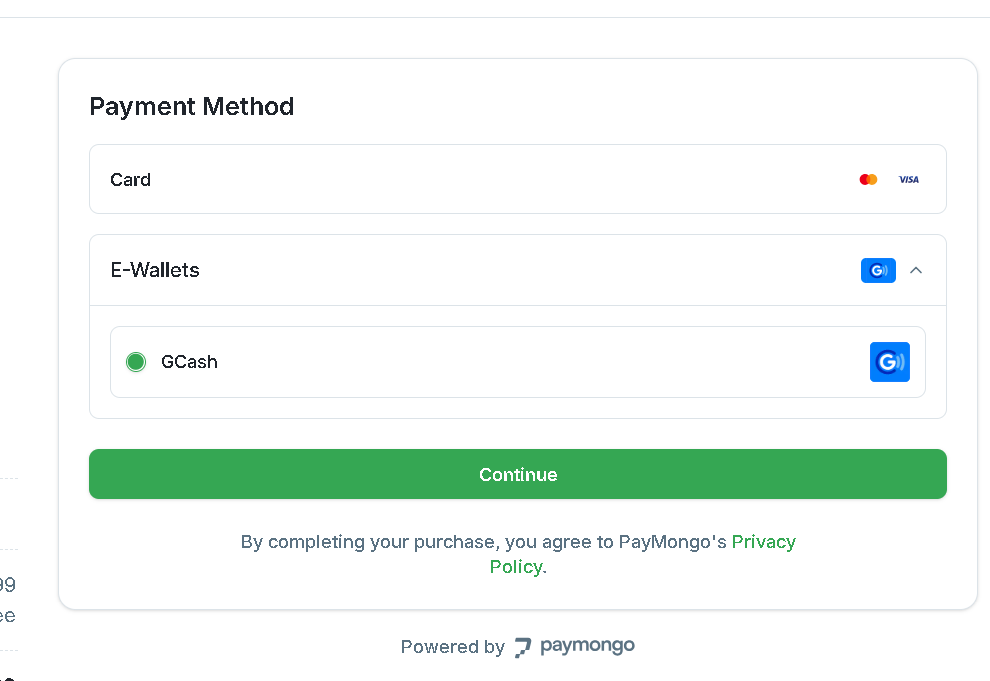
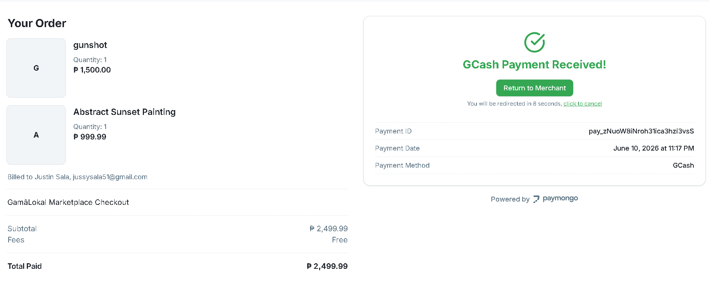

# Project Homepage > Secure Payment Integration

---

## Functional Description
The **Secure Payment Integration** module handles all financial transactions on the platform, ensuring safe and reliable payments for both buyers and sellers.

Key features include:
- **PayMongo Gateway:** Support for GCash and Card payments through a secure local payment provider.
- **Cart & Checkout:** Manage multiple marketplace items and proceed to a unified checkout.
- **Artist Payouts:** Specialized dashboard for artists to track earnings and request withdrawals via GCash.
- **Automated Order Tracking:** Ledger system to track payment status (Pending, Paid, Cancelled).

---

## Use Case Scenario

| Actor | Action | System Response |
| :--- | :--- | :--- |
| User | Clicks the cart icon | System displays the current list of items in the cart. |
| User | Clicks "Proceed to Checkout" | System initializes a PayMongo session and redirects to the payment page. |
| User | Completes payment on GCash/Card | System marks the payment as paid and notifies the artist(s). |
| Artist | Views dashboard earnings | System displays the current balance from completed sales and commissions. |
| Artist | Submits a payout request | System logs the request for admin review and withdrawal processing. |

---

[← Back to Project Homepage](project-homepage.md)

© 2026 Arktic
