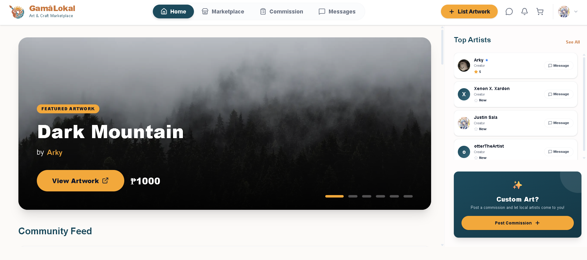
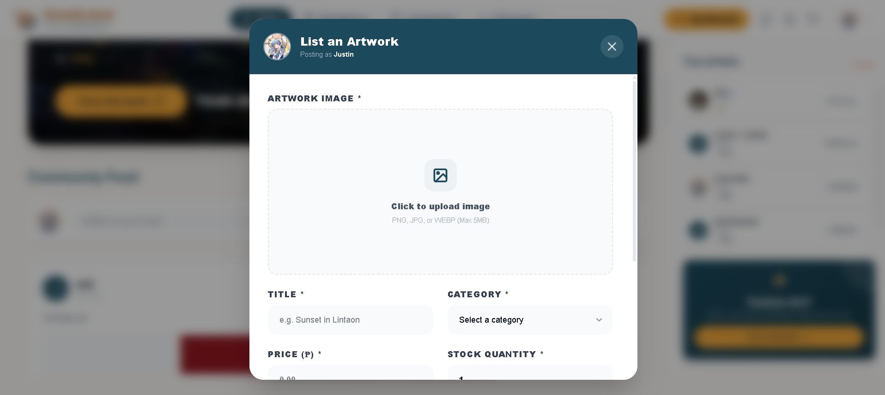
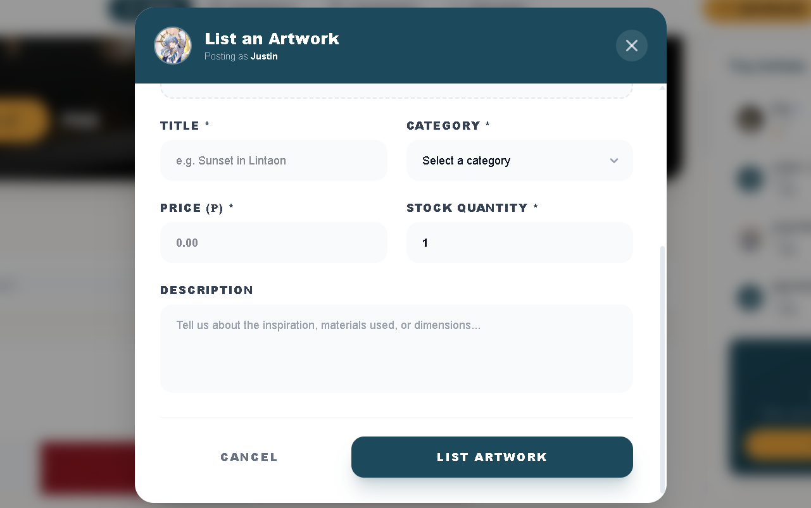

# Project Homepage > Social Feed and Interaction

---

## Functional Description
The **Social Feed and Interaction** module serves as the heart of the GamâLokal community, allowing users to showcase their work, discover new art, and engage with other creators.

Key features include:
- **Community Feed:** A dynamic stream of the latest artwork and status updates from local artists.
- **Interactions:** Like and comment on posts to provide feedback and encourage artists.
- **Artwork Tagging:** Link community posts directly to marketplace artworks for easy discovery and purchase.
- **Link Sharing:** Quickly copy a direct link to any post for sharing outside the platform.

---

## Use Case Scenario

| Actor | Action | System Response |
| :--- | :--- | :--- |
| Artist | Clicks "+ Post Artwork" | System displays the post creation modal with image upload. |
| User | Clicks the heart icon | System toggles the "Like" status and updates the count in real-time. |
| User | Enters a comment and clicks "Post" | System adds the comment to the thread and notifies the author. |
| User | Clicks the Share icon | System copies the direct post URL to the user's clipboard for easy sharing. |
| Artist | Deletes their own post | System removes the post and all associated likes/comments from the feed. |

---

[← Back to Project Homepage](project-homepage.md)

© 2026 Arktic
